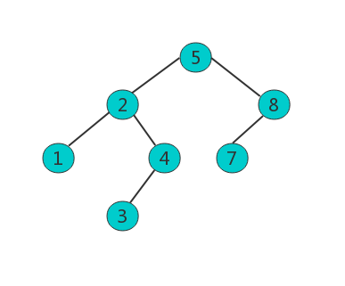

# B树与B+树

B+树索引是B+树在数据库中的一种实现，是最常见也是使用最频繁的一种索引。B+树中的B代表平衡（balance），B+树是从最早的平衡二叉树演化而来的。在讲B+树之前必须先了解二叉查找树、平衡二叉树（AVLTree）和平衡多路查找树（B-Tree），B+树即由这些树逐步优化而来。

## 一、二叉查找树

二叉树的特征：

- 左子树的键值小于根的键值。
- 右子树的键值大于根的键值。 

对二叉树的节点进行查找时深度为1的节点的查找次数为1，深度为2的查找次数为2，深度为n的节点的查找次数为n。

所以上图二叉树的平均查找次数为 (1+2+2+3+3+3) / 6 = 2.3次

如果二叉树不平衡，查询效率就低。若想二叉树的查询效率高，需要这棵二叉树是平衡的，从而引出新的定义——平衡二叉树（AVL Tree）。

## 二、平衡二叉树（AVL Tree）

平衡二叉树的特征：

- 左子树的键值小于根的键值。
- 右子树的键值大于根的键值。 
- **任何节点的两个子节点的高度最大差为1**。

## 三、平衡多路查找树（B-Tree）

B-Tree中的每个节点可以包含大量的关键字信息和分支。

m阶的B-Tree有如下特性： 

1. 每个节点最多有m个子节点。 
2. 除了根节点和叶子节点外，其它每个节点至少有Ceil(m/2)个孩子。 （Ceil朝正无穷方向取整如：Ceil（3.1）=4）
3. 若根节点不是叶子节点，则至少有2个孩子 。
4. 所有叶子节点都在同一层，且不包含其它关键字信息 。
5. 每个非终端节点包含n个关键字信息（P0,P1,…Pn, k1,…kn） 
6. 关键字的个数n满足：Ceil(m/2)-1 <= n <= m-1 
7. Ki(i=1,…n)为关键字，且关键字升序排序。 
8. Pi(i=1,…n)为指向子树根节点的指针。P(i-1)指向的子树的所有节点关键字均小于Ki，但都大于k(i-1)

3阶B-Tree如下图所示： 

每个节点占用一个盘块的磁盘空间，一个节点有两个升序排序的关键字和三个指向子树根节点的指针，指针存储的是子节点所在磁盘块的地址。两个关键字划分成的三个范围域对应三个指针指向的子树的数据的范围域。

以根节点为例：

- 关键字为17和35。
- P1指针指向的子树的数据范围为小于17。
- P2指针指向的子树的数据范围为17~35。
- P3指针指向的子树的数据范围为大于35。

模拟查找关键字29的过程：

1. 根据根节点找到磁盘块1，读入内存。【磁盘I/O操作第1次】
2. 比较关键字29在区间（17,35），找到磁盘块1的指针P2。
3. 根据P2指针找到磁盘块3，读入内存。【磁盘I/O操作第2次】
4. 比较关键字29在区间（26,30），找到磁盘块3的指针P2。
5. 根据P2指针找到磁盘块8，读入内存。【磁盘I/O操作第3次】
6. 在磁盘块8中的关键字列表中找到关键字29。

分析上面过程，发现需要3次磁盘I/O操作，和3次内存查找操作。由于内存中的关键字是一个有序表结构，可以利用二分法查找提高效率。而3次磁盘I/O操作是影响整个B-Tree查找效率的决定因素。B-Tree相对于AVLTree缩减了节点个数，使每次磁盘I/O取到内存的数据都发挥了作用，从而提高查询效率。

## 四、B+Tree

B+Tree在B-Tree基础上优化，使其更适合实现外存储索引结构，InnoDB存储引擎就是用B+Tree实现其索引结构。

​	从上一节中的B-Tree结构图中可以看到每个节点中不仅包含数据的键值，还有数据值。而每一个页的存储空间是有限的，如果data数据较大时将会导致每个节点（即一个页）能存储的键的数量很小，当存储的数据量很大时同样会导致B-Tree的深度较大，增大查询时的磁盘I/O次数，进而影响查询效率。

​	在B+Tree中，所有数据记录节点都是按照键值大小顺序存放在同一层的叶子节点上，而非叶子节点上只存储键值信息，这样可以加大每个节点存储的键值数量，降低B+Tree的深度。

B+Tree相对于B-Tree有几点不同：

1. 非叶子节点只存储键值信息。
2. 所有叶子节点之间由指针形成链表。
3. 数据记录都存放在叶子节点中。

B+Tree的非叶子节点只存储键值信息，假设每个磁盘块能存储4个键值及指针信息，变成B+Tree后结构如下：

通常在B+Tree上有两个头指针，一个指向根节点，另一个指向关键字最小的叶子节点，而且所有叶子节点（即数据节点）之间是一种链式环结构。

因此可以对B+Tree进行两种查找运算：

- 对于主键的范围查找和分页查找.
- 从根节点开始，进行随机查找。

InnoDB存储引擎中页的大小为16KB，一般表的主键类型为Int（占用4个字节）或Bi（占用8个字节），指针类型也一般为4或8个字节，也就是说一个页（B+Tree中的一个节点）中大概存储16KB/(8B+8B)=1K个键值（因为是估值，为方便计算，这里的K取值为10^3）。也就是说一个深度为3的B+Tree索引可以维护10^3 * 10^3 * 10^3 = 10亿 条记录。

​	实际情况中每个节点可能不能填充满，因此在数据库中，B+Tree的高度一般都在2~4层。mysql的InnoDB存储引擎在设计时是将根节点常驻内存的，也就是说查找某一键值的行记录时最多只需要1~3次磁盘I/O操作。

​	数据库中的B+Tree索引可以分为聚集索引（clustered index）和辅助索引（secondary index）。上面的B+Tree示例图在数据库中的实现即为聚集索引，聚集索引的B+Tree中的叶子节点存放的是整张表的行记录数据。

​	辅助索引与聚集索引的区别在于辅助索引的叶子节点并不包含行记录的全部数据，而是存储相应行数据的聚集索引键（即主键）。当通过辅助索引来查询数据时，InnoDB存储引擎会遍历辅助索引找到主键，然后再通过主键在聚集索引中找到完整的行记录数据。